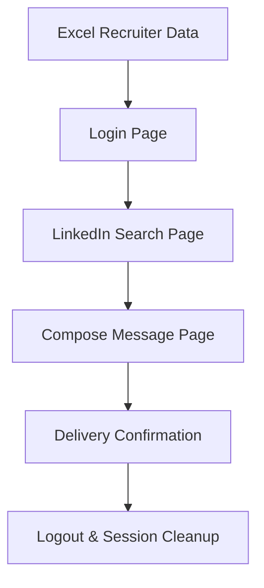

# LinkedIn Automation Testing Project

<div align="center">


</div>

## 📌 Project Overview
The **LinkedIn Automation Testing Project** is an end-to-end Playwright framework that simulates the way a real user engages with LinkedIn recruiters. From launching the application, authenticating, searching for recruiter profiles, composing personalised messages, and logging out—every interaction is validated to guarantee a dependable outreach experience.

This repository mirrors the artefacts curated in my Notion workspace, including the testing epics, strategies, and execution insights that guided the build of the automation suite. It is designed for fast local feedback, enterprise reporting (Zephyr Scale & Allure), and seamless integration with CI/CD pipelines.

## 🚀 Why this framework stands out
- **Enterprise-ready architecture** with Page Object Model, reusable helpers, and clean hooks.
- **Data-driven orchestration** powered by Excel to control recruiter targets and message templates.
- **Zephyr Scale integration** for live sync between automated runs and test management.
- **Optimised for cloud or on-prem execution** across GitHub Actions, Jenkins, and Docker.
- **Battle-tested workflows** derived from structured smoke, regression, and UAT cycles.

## 🧭 Table of Contents
- [Architecture & Tech Stack](#-architecture--tech-stack)
- [Automation Epics](#-automation-epics)
- [Functionality Coverage](#-functionality-coverage)
- [Test Strategy & Cycles](#-test-strategy--cycles)
- [Setup & Local Execution](#-setup--local-execution)
- [Reports & Integrations](#-reports--integrations)
- [Repository Layout](#-repository-layout)
- [Future Enhancements](#-future-enhancements)
- [Acknowledgements](#-acknowledgements)

## 🏗️ Architecture & Tech Stack
- **Playwright + TypeScript** for deterministic, cross-browser E2E automation.
- **Custom Test Hooks** (`hooks/hooks.ts`) clear cookies, localStorage, and sessionStorage to ensure clean sessions per scenario.
- **ExcelJS/XLSX** for recruiter data ingestion, enabling large-scale campaigns without code changes.
- **Dotenv** for secure credential management.
- **Allure & Zephyr reporters** for rich analytics and traceability back to requirements.
- **Docker & Jenkins blueprints** to containerise and orchestrate scheduled outreach checks.



## 🗂️ Automation 
|  | Goal | Key Outcomes |
| --- | --- | --- |
| **Story-1 Recruiter Outreach Backbone** | Deliver a reliable happy-path flow that mirrors a recruiter outreach journey. | Validates login, recruiter discovery, tailored messaging, and clean logout. |
| **Story-2 Data-Driven Personalisation** | Empower business teams to curate outreach lists without code changes. | Excel ingestion, row-by-row iteration, templated messaging, duplicate handling. |
| **Story-3 Quality Intelligence & Reporting** | Make every run observable and auditable. | Zephyr Scale sync, Allure dashboards, run metadata capture (build, environment, dataset). |
| **Story-4 Resilience & Recovery** | Protect the outreach flow against platform quirks. | Clean session hooks, retry-ready architecture, roadmap for API fallbacks and hybrid navigation. |

## ✅ Functionality Coverage
| Module | Positive Paths | Negative / Edge Scenarios | Automation Notes |
| --- | --- | --- | --- |
| **Authentication** | Valid credentials, redirected home feed, LinkedIn logo assertion. | Invalid credentials, empty fields, expired sessions (mocked in regression suite). | `LoginPage.login()` centralises selectors and waits. |
| **Recruiter Search** | Keyword-based search, navigation to recruiter cards, returning to feed. | Empty query, pagination, invalid names, network throttling (planned). | `LinkedInSearchPage.searchForRecruiterNames()` reads Excel-driven data. |
| **Messaging** | Compose message modal, personalised template injection, send & close flow. | Duplicate messaging safeguards, blank message validation, attachment placeholder. | `ComposeMessagePage.fillMessageFromRow()` hydrates templates per recruiter. |
| **Data Layer** | Excel parsing (First Name, Last Name, Full Name). | Missing columns, malformed rows, empty sheet. | `readRecruiterNames.ts` fails fast with descriptive errors. |
| **Session Hygiene** | Post-run logout, cookie/cache purge. | Stale sessions, multi-account switching. | Hooks reset browser context before each test run. |

## 🧪 Test Strategy & Cycles
- **Smoke Suite (Cycle A):** Fast validation of the golden path (login → search → message → logout) on every commit.
- **Component Regression (Cycle B):** Focused suites for Authentication, Search, and Messaging, covering both positive and negative cases.
- **End-to-End UAT (Cycle C):** Friday dry run with production-like data, Monday live run against curated recruiter lists.
- **Performance Snapshots:** Timed runs with 10/50/100 recruiters to monitor throughput, latency per message, and retry counts.

### Strategic Playbooks
1. **Search-Based Outreach:** Default flow; search by name, open profile, send personalised message.
2. **Direct URL Navigation:** (Roadmap) Bypass search by loading profile URLs from Excel.
3. **Hybrid Fallback:** Combine search + direct navigation to mitigate LinkedIn throttling.
4. **API-Seeded Outreach:** (Future) Use LinkedIn/3rd-party APIs to hydrate recruiter data before UI execution.

## 🛠️ Setup & Local Execution
1. **Clone the repository**
   ```bash
   git clone https://github.com/sameermanzur/Linkedin-Automation-Testing-Project.git
   cd Linkedin-Automation-Testing-Project
   ```
2. **Install dependencies**
   ```bash
   npm install
   ```
3. **Configure environment variables** in a `.env` file:
   ```env
   BASE_URL=https://www.linkedin.com
   LINKEDIN_USERNAME=your_email@example.com
   LINKEDIN_PASSWORD=your_password
   ZEPHYR_TOKEN=your_zephyr_api_key
   ```
4. **Prepare data** by updating [`data/recruiterList.xlsx`](data/recruiterList.xlsx) with the recruiters you want to target.

### Run the end-to-end flow
```bash
npx playwright test
```

### Debug or iterate locally
```bash
npx playwright test tests/verifyE2EuserFlow.spec.ts --headed --debug
```

> Hooks automatically clear cookies, localStorage, and sessionStorage before each test to maintain deterministic runs.

## 📊 Reports & Integrations
- **Allure Reports:** Generate immersive dashboards with historical runs, attachments, and trace files.
- **Zephyr Scale:** Push automated execution results to Jira, maintaining parity between manual and automated suites.
- **Artifacts:** Store Playwright traces, HAR files, and screenshots for post-mortem analysis.

## 🗂 Repository Layout
```
├── data/                    # Excel datasets for recruiter campaigns
├── hooks/                   # Custom Playwright test fixtures & hooks
├── tests/
│   ├── pages/               # Page Object Model classes
│   └── verifyE2EuserFlow.spec.ts  # Core end-to-end scenario
├── index.html               # Portfolio/GitHub Pages landing page
├── playwright.config.ts     # Global Playwright configuration
└── README.md                # You are here
```

## 🔭 Future Enhancements
- Parallel shards driven by recruiter segments (e.g., geography, role, seniority).
- Resilience testing with built-in retry heuristics and network throttling simulations.
- API orchestration to fetch fresh recruiter leads and warm the UI with context.
- Dashboard widgets summarising outreach volume, success rates, and defect trends.

## 🙌 Acknowledgements
Huge thanks to **Swaroop Landge** for relentless mentorship and guidance on my QA Automation journey. This project aggregates insights from our Notion workspace, GitHub experimentation, and real-world outreach experiments.
